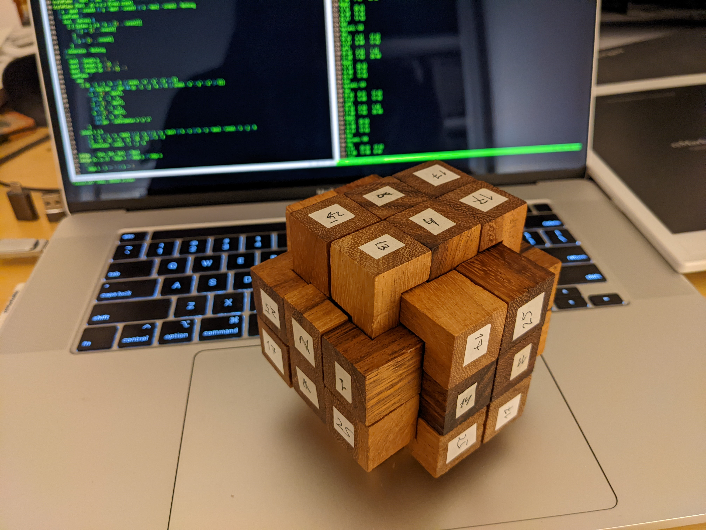
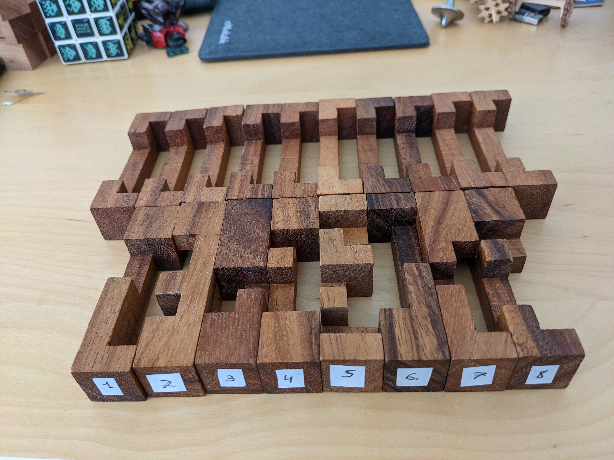

# crest18-puzzle
This is repository to solve puzzle that is crest from 18 sticks.  
Here is solved puzzle:  


And these are parts:  


On the image with parts parts without number (second rows) should have number 17 on them.  
For each part there is (n+8) on the other side.  

File [result.txt](./result.txt) contains all results program found. And proper result is `Variant 126`:
```
Variant: 126
Top
25 A2	8 A1	17 A2
13 A1	4 A0	17 A2
Left
25 A2	2 A3	1 A2
17 A0	7 A3	25 A0
Right
17 A1	25 A3
14 A0	11 A2
25 A1	17 A3
End
```
I didn't try varaiants 127-138.
